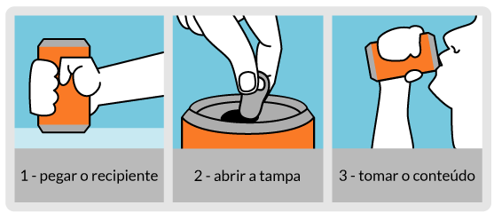

# Lógica de Programação e Algoritmos

Hoje você vai aprender sobre algoritmos e lógica de programação, a base de tudo que faremos daqui pra frente.

Assim como em uma receita de bolo, na programação, devemos passo a passo utilizar comandos para resolver um problema. 

Essa sequência de comandos se chama  `algoritmo` . 

Para criar um algoritmo, temos que desenvolver uma capacidade analítica para transformar grandes problemas em pequenos e encadeados comandos lógicos. Desenvolvemos essa forma de raciocinar com a `lógica de programação`.

---
<h2 align="center">
   
  
   
</h2>

## Lógica de Programação
A lógica de programação consiste em uma série de regras e normas baseadas na lógica matemática e em teorias da computação, que tem como objetivo facilitar o raciocínio no momento da criação de uma cadeia de comandos.

 
Quando nos deparamos com problemas, devemos raciocinar e enxergar quais os caminhos possíveis para a sua resolução. Muitas vezes esses caminhos são múltiplos, o que nos leva a decidir qual percorrer. 

---

## Algoritmos
O algoritmo é uma série de comandos encadeados de forma lógica, que busca resolver algum problema.
Utilizamos lógica em muitos momentos do nosso dia a dia de forma automática. Pense no leite com achocolatado que você toma pela manhã. Simples fazê-lo, não? Vejamos o passo a passo:
<h2 align="center">
   
  
   
</h2>

1. Pegar um copo
2. Colocar o copo em cima da mesa
3. Abrir a porta da geladeira
4. Pegar o leite
5. Fechar a porta da geladeira
6. Colocar determinada quantidade de leite no copo
7. Abrir o armário
8. Pegar o achocolatado
9. Fechar a porta do armário
10. Colocar determinada quantidade de achocolatado no copo
11. Pegar uma colher
12. Mexer no copo com a colher
Imagine se tivéssemos que pensar em todo esse passo a passo toda manhã. Felizmente, já conseguimos interpretar essa série de instruções de forma lógica e automática.

 

> Lembre-se: os computadores são burros. Eles levam tudo "ao pé da letra". Por isso, cada comando deve ser cirurgicamente determinado.

 

 Caso, no passo 4, estivesse escrito "Pegar o lete", o que seria pra nós um simples erro ortográfico, mas que não traria danos à execução do processo, para o computador seria um erro de sintaxe, que inviabilizaria o funcionamento do algoritmo.

  
 Porém, algumas ordens poderiam ser trocadas sem prejuízo na execução. Por exemplo, poderíamos utilizar os passos 7, 8, 9 e 10 antes dos 3, 4, 5 e 6. Ou seja, colocar o achocolatado no copo antes do leite. Esse tipo de decisão é comum na vida das pessoas desenvolvedoras.

.

Após escrever o algoritmo, responda as seguintes perguntas:

* Eu resolvi o problema?
* Havia outras maneiras de resolver o problema?
* A maneira que eu escolhi foi a mais eficiente possível, ou havia como fazer a mesma coisa com menos passos?
* Seria possível inverter ou retirar algum passo?
* Se eu fosse um computador, conseguiria entender todas as instruções?

MDN: [Como funciona um algoritmo](https://rockcontent.com/br/blog/algoritmo/)
